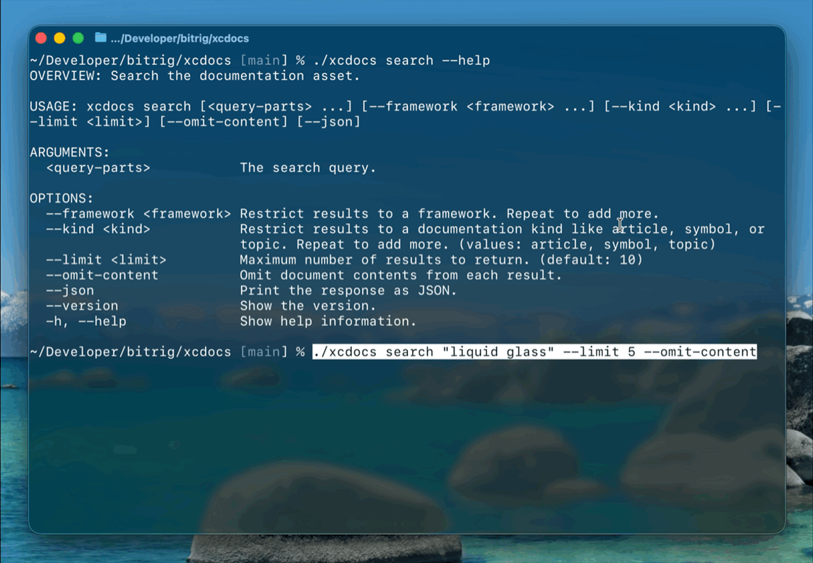

# XCDocs



**XCDocs lets your agents quickly search local Apple docs without keeping Xcode open!**

It uses the vector database powering Xcode's `DocumentationSearch` MCP tool under the hood, which is already on your Mac.

Includes:
- `xcdocs` CLI & agent skill, designed for use by agents like Codex or Claude Code
- Swift package, to integrate `XCDocs` into other tools

## Availability

- macOS 26+
- Apple silicon only
- Xcode 26.3 RC or above has to be installed, but you don't need Xcode open.

## Install

Ask your agent to help!

#### Recommended

Download the CLI from [Releases](releases) and put it in `/usr/local/bin`.

#### Alternative

You can also clone the repo and run `swift build` yourself. The resulting binary will be in `.build/debug/xcdocs`.

## Agent Skill

- Codex: Tell agent to copy/symlink `.agents/skills/xcdocs` to `~/.agents/skills/xcdocs`
- Claude Code: Tell agent to copy/symlink `.agents/skills/xcdocs` to `~/.claude/skills/xcdocs`

## Usage

```bash
xcdocs --help
```

Search for documentation:

```bash
xcdocs search "swift testing"
xcdocs search "swift testing" --framework "Swift Testing" --limit 5
xcdocs search "swift testing" --kind article --limit 5
xcdocs search "swiftui color" --json
xcdocs search "swiftui color" --omit-content
```

Get an entry by identifier:

```bash
xcdocs get /documentation/Testing
xcdocs get /documentation/Testing --json
```

## Swift API

XCDocs also exposes a Swift package which you can integrate into other tools.

To get started, add the repo to your `Package.swift`.

```swift
import XCDocs

let client = Client()

let searchResults = try await client.search(
    "swift testing",
    frameworks: ["Swift Testing"],
    kinds: [.article],
    limit: 5,
    omitContent: false
)

let entry = try await client.entry(
    for: "/documentation/Testing"
)
```

## Development

Run tests:

```bash
swift test
```

Run formatting checks:

```bash
swift format lint --strict Package.swift
swift format lint --strict --recursive Sources Tests
```
